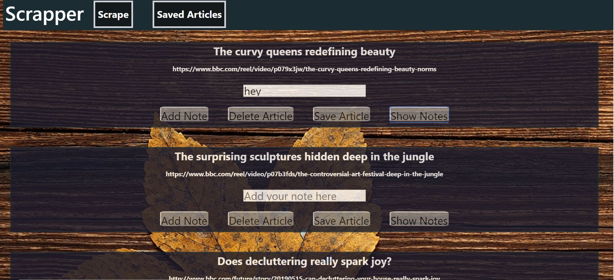

# Scrapper

This web application scraps the news from the BBC official websites. Beside scrapping the news, it also allows the user to comment/ make notes on the articles. The application uses MOngo DB as the database.

##Technologies Used
Axios
Cheerio
MongoDB
Node/Express
JavaScript/ jQuery
HTML
CSS

##Deployed Version
[BBC Scrapper](https://polar-thicket-41813.herokuapp.com/)

